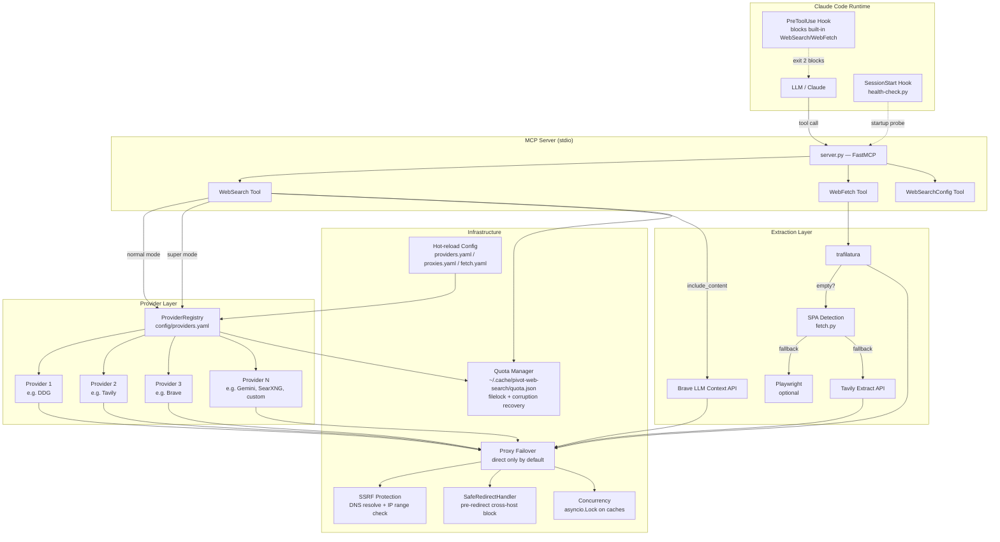
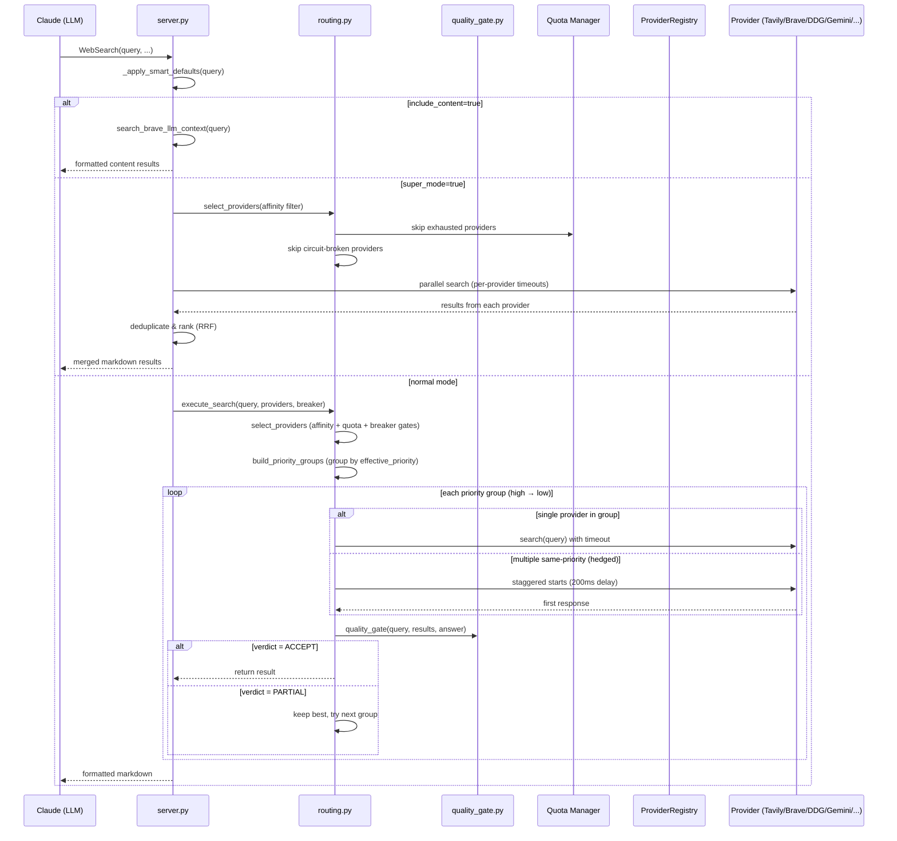
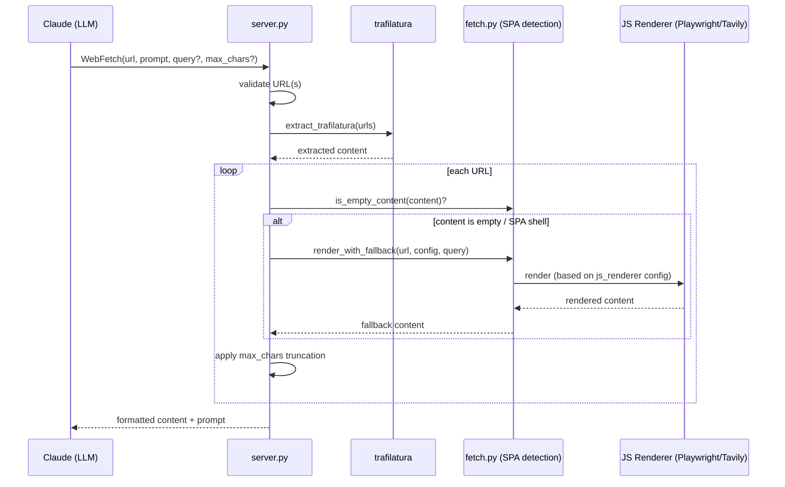
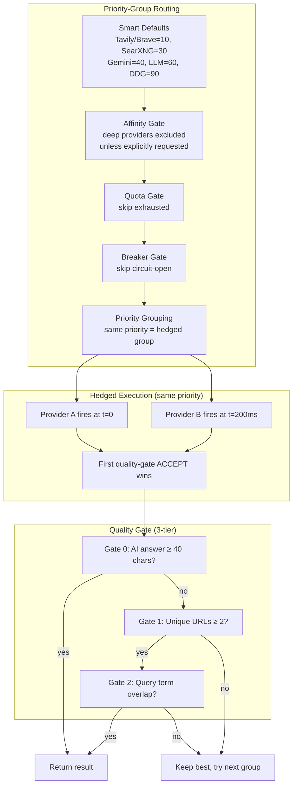
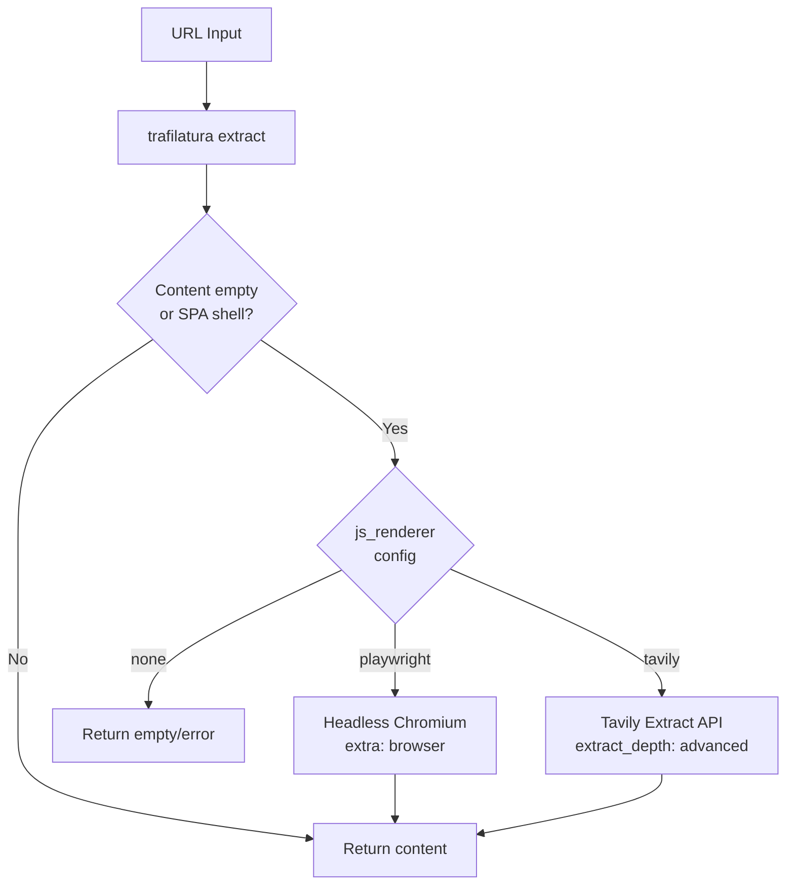

# Architecture

## System Overview



## Request Flow — WebSearch



## Request Flow — WebFetch



## Provider Routing Strategy



> Built-in adapters: DDG, Tavily, Brave, Gemini, SearXNG, a generic `json_api` adapter for any REST search API, and `llm_search` for any LLM with built-in web search grounding (Perplexity Sonar Pro, OpenAI web_search, SAP AI Core, etc.). New adapters are one class. `searxng`, `json_api`, and `llm_search` types can be instantiated multiple times with different names — each instance gets independent priority, quota tracking, and circuit breaker state. The `llm_search` adapter uses a Strategy pattern (`LlmSearchFormat`) with pluggable format handlers (`chat_completions`, `responses`, `gemini`).

## WebFetch JS Fallback



## File Structure

```
pivot-web-search/
├── .claude-plugin/          # Claude Code plugin manifest
│   ├── plugin.json          # Tool declarations, userConfig schema
│   └── marketplace.json     # Marketplace listing
├── .mcp.json                # MCP server launch config (stdio)
├── ARCHITECTURE.md          # This file
├── config/
│   ├── providers.yaml       # Search providers (type, priority, timeout, affinity)
│   ├── proxies.yaml         # Proxy endpoints (failover order)
│   └── fetch.yaml           # WebFetch config (JS renderer, limits)
├── hooks/
│   └── hooks.json           # PreToolUse block + SessionStart health
├── scripts/
│   ├── health-check.py      # Startup probe (parallel provider check)
│   └── pretool-check.py     # PreToolUse hook — fail-open tool blocker
├── pivot_web_search_mcp/
│   ├── __init__.py
│   ├── __main__.py          # Entry: mcp.run(transport="stdio")
│   ├── server.py            # FastMCP server, 3 tools, smart defaults
│   ├── search.py            # Core: search, proxy failover, extraction, dedup_and_rank
│   ├── providers.py         # ProviderRegistry, adapters, config loaders
│   ├── llm_search_formats.py # Strategy pattern for LLM search API formats
│   ├── routing.py           # Priority-group routing, hedging, circuit breaker
│   ├── quality_gate.py      # 3-tier quality gate (answer/URLs/keywords)
│   ├── fetch.py             # SPA detection, JS renderer dispatch
│   ├── logging.py           # Centralized logging (stderr + optional file)
│   └── quota.py             # Per-provider quota tracking, filelock (cross-platform)
├── tests/                   # 265 tests (pytest-asyncio), 15 modules
├── skills/pivot-web-search/       # Skill definition for Claude Code
└── docs/                    # Design documents (not tracked in git)
```

## Key Design Principles

1. **Zero mandatory external deps for search** — DDG works with no API key
2. **Priority-group routing** — same-priority providers hedged, first quality-gate pass wins
3. **Config-driven** — providers, proxies, and fetch behavior all via YAML, hot-reloadable
4. **Quota-aware** — binary exclusion (exhausted = skip), no implicit throttling
5. **Per-provider timeouts** — no global budget, each provider gets its configured deadline
6. **Smart defaults** — quality-first ordering (Tavily/Brave > Gemini > LLM > DDG) when no explicit priority
7. **3-tier quality gate** — AI answer presence, URL count, keyword overlap drives failover
8. **Fixed 60s circuit breaker** — 3 consecutive failures opens, no exponential backoff
9. **Provider affinity** — deep research providers excluded from normal routing unless explicitly requested
10. **Security by default** — SSRF protection, pre-redirect blocking, credential redaction
11. **Cross-platform** — filelock instead of fcntl, works on Windows/macOS/Linux
12. **Async-safe** — shared mutable state protected by `asyncio.Lock`; config loaders use `threading.Lock`
