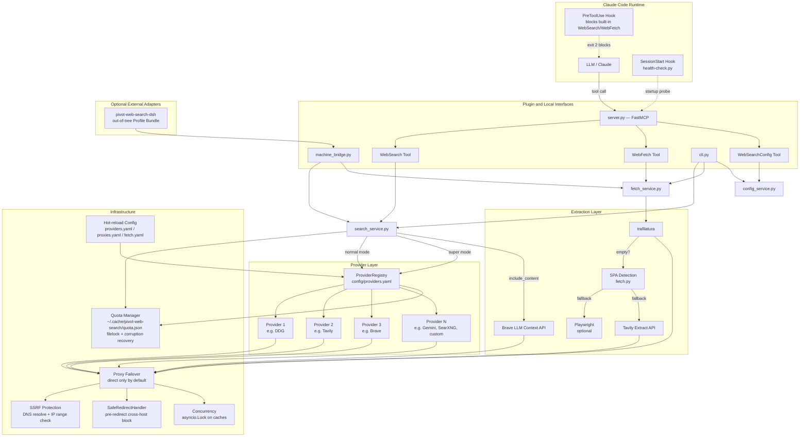
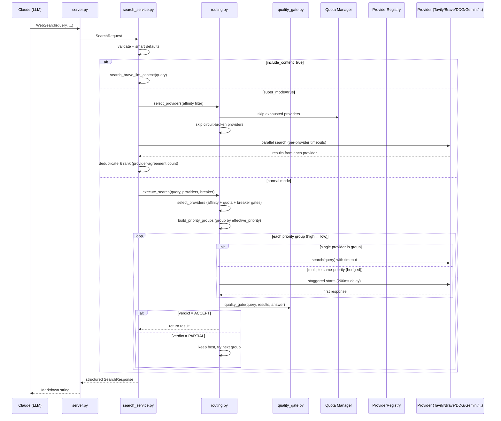
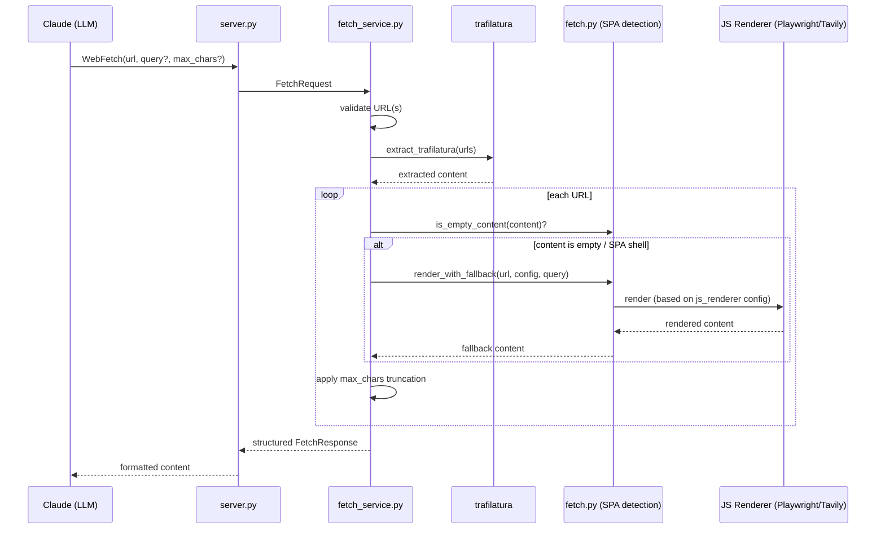
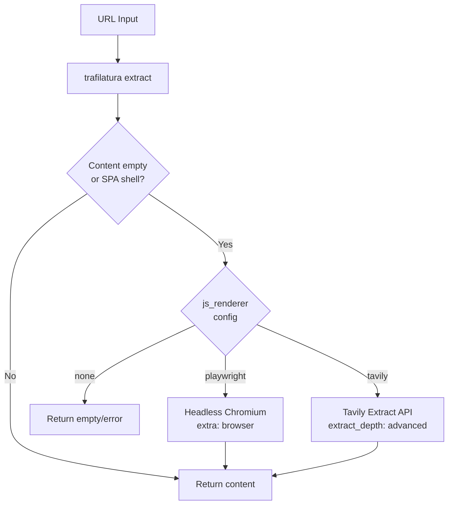

# Architecture

## System Overview



## Product and Adoption Boundary

The repository's product is the Claude Code Plugin. MCP is the Plugin's
model-facing transport, while the CLI and machine bridge are additional
interfaces over the same Python services.

Host adoption is always out-of-tree. A host either connects to the MCP server
or installs a thin adapter maintained by Pivot. The DeepSeek Harness adapter is
such a package: its Profile Bundle registers providers through DSH's published
`ctx.web` and `ctx.subprocess` contracts. It does not patch, fork, or require a
build of the DSH source repository.

## Request Flow — WebSearch



## Request Flow — WebFetch



## Provider Routing Strategy


> Built-in adapters: DDG, Tavily, Brave, Gemini, SearXNG, a generic `json_api` adapter for any REST search API, and `llm_search` for any LLM with built-in web search grounding (Perplexity Sonar Pro, OpenAI web_search, SAP AI Core, etc.). New adapters are one class. `searxng`, `json_api`, and `llm_search` types can be instantiated multiple times with different names — each instance gets independent priority, quota tracking, and circuit breaker state. The `llm_search` adapter uses a Strategy pattern (`LlmSearchFormat`) with pluggable format handlers (`chat_completions`, `responses`, `gemini`).

## WebFetch JS Fallback



## File Structure

```
pivot-web-search/                      # marketplace + dev repo root
├── .claude-plugin/
│   └── marketplace.json               # Marketplace manifest → ./plugins/pivot-web-search
├── plugins/pivot-web-search/          # Plugin payload (CLAUDE_PLUGIN_ROOT at install time)
│   ├── .claude-plugin/plugin.json     # Tool declarations, userConfig schema
│   ├── .mcp.json                      # MCP server launch config (stdio)
│   ├── pyproject.toml + uv.lock       # Runtime deps, resolved by uv at startup
│   ├── config/
│   │   ├── providers.yaml             # Search providers (type, priority, timeout, affinity)
│   │   ├── proxies.yaml               # Proxy endpoints (failover order)
│   │   └── fetch.yaml                 # WebFetch config (JS renderer, limits)
│   ├── hooks/
│   │   └── hooks.json                 # PreToolUse block + SessionStart health
│   ├── scripts/
│   │   ├── health-check.py            # Startup probe (parallel provider check)
│   │   └── pretool-check.py           # PreToolUse hook — fail-open tool blocker
│   ├── pivot_web_search_mcp/
│   │   ├── __init__.py
│   │   ├── __main__.py                # Entry: mcp.run(transport="stdio")
│   │   ├── server.py                  # FastMCP adapter, 3 Plugin tools
│   │   ├── search_service.py          # Authoritative structured search orchestration
│   │   ├── fetch_service.py           # Authoritative extraction and fallback orchestration
│   │   ├── config_service.py          # Status and reload operations
│   │   ├── presentation.py            # Markdown and JSON projections
│   │   ├── cli.py                     # Human-facing CLI
│   │   ├── machine_bridge.py          # Host-neutral one-shot JSON protocol
│   │   ├── backends.py                # HTTP adapters: DDG/Tavily/Brave/Gemini
│   │   ├── extraction.py              # trafilatura wrapper
│   │   ├── http_client.py             # Shared httpx client + proxy failover
│   │   ├── results.py                 # dedup_and_rank, markdown rendering
│   │   ├── validation.py              # URL/SSRF validation
│   │   ├── config.py                  # YAML config loaders (hot-reload)
│   │   ├── defaults.py                # Smart-defaults priority table
│   │   ├── providers/                 # Provider subpackage
│   │   │   ├── __init__.py            # Public re-exports
│   │   │   ├── base.py                # SearchProvider, SearchResult
│   │   │   ├── adapters.py            # 6 adapters (Ddg/Tavily/Brave/LlmSearch/Searxng/JsonApi) + ADAPTER_MAP
│   │   │   └── registry.py            # ProviderRegistry with mtime reload
│   │   ├── llm_search_formats.py      # Strategy pattern for LLM search API formats
│   │   ├── routing.py                 # Priority-group routing, hedging, circuit breaker
│   │   ├── quality_gate.py            # 3-tier quality gate (answer/URLs/keywords)
│   │   ├── fetch.py                   # SPA detection, JS renderer dispatch
│   │   ├── logging.py                 # Centralized logging (stderr + optional file)
│   │   └── quota.py                   # Per-provider quota tracking, filelock (cross-platform)
│   └── skills/pivot-web-search/       # Skill definition for Claude Code
├── integrations/deepseek-harness/     # Installable external DSH Profile Bundle
├── tests/                             # 362 tests (355 offline + 7 integration)
├── pyproject.toml                     # uv workspace shell — dev deps + lint/test config
├── ARCHITECTURE.md                    # This file
└── docs/                              # Design documents (not tracked in git)
```

## Key Design Principles

1. **Zero mandatory external deps for search** — DDG works with no API key
2. **Priority-group routing** — same-priority providers hedged, first quality-gate pass wins
3. **Config-driven** — providers, proxies, and fetch behavior all via YAML, hot-reloadable
4. **Quota-aware** — binary exclusion (exhausted = skip), no implicit throttling
5. **Per-provider timeouts** — no global budget, each provider gets its configured deadline
6. **Smart defaults** — quality-first ordering (LLM Search > Tavily/Brave/Gemini > SearXNG/json_api > DDG) when no explicit priority
7. **3-tier quality gate** — AI answer presence, URL count, keyword overlap drives failover
8. **Fixed 60s circuit breaker** — 3 consecutive failures opens, no exponential backoff
9. **Provider affinity** — deep research providers excluded from normal routing unless explicitly requested
10. **Security by default** — SSRF protection, pre-redirect blocking, credential redaction
11. **Cross-platform** — filelock instead of fcntl, works on Windows/macOS/Linux
12. **Async-safe** — single-threaded asyncio, no thread locks; config loaders use mtime caching (`cache_still_valid`)
