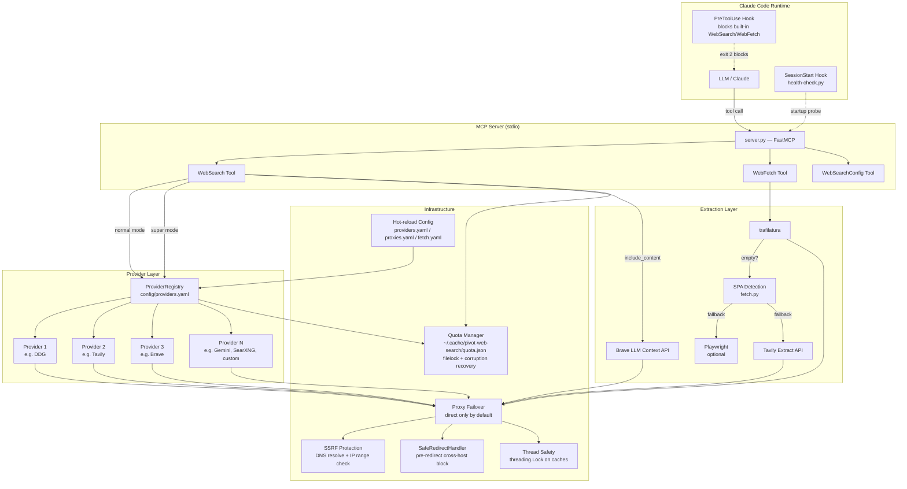
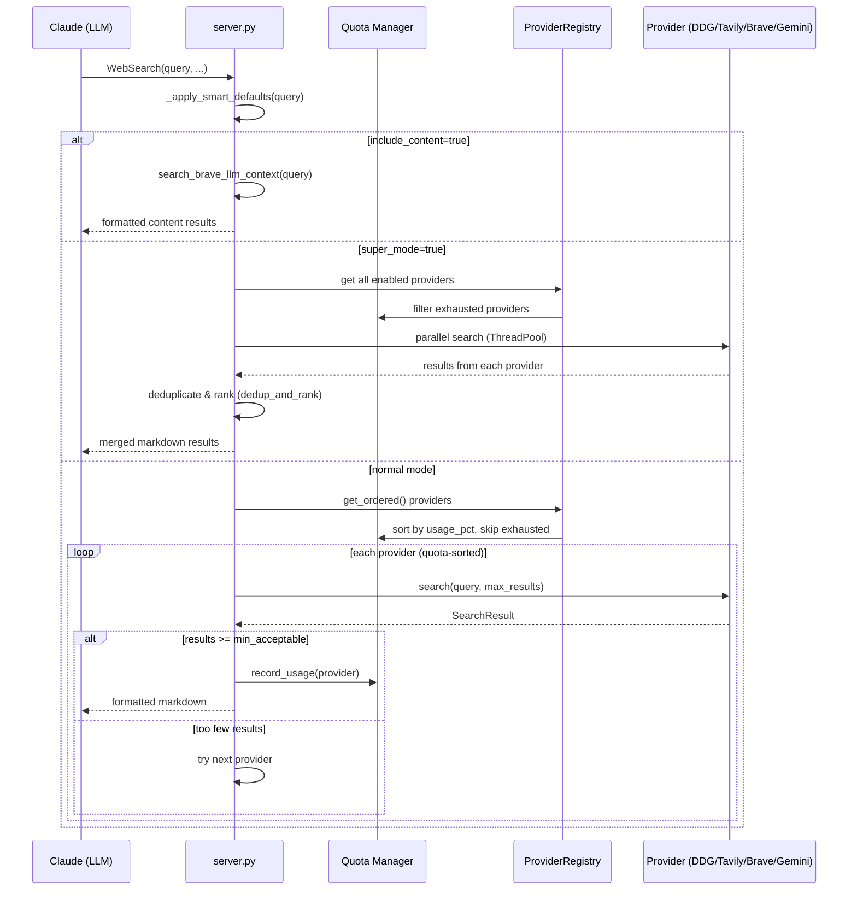
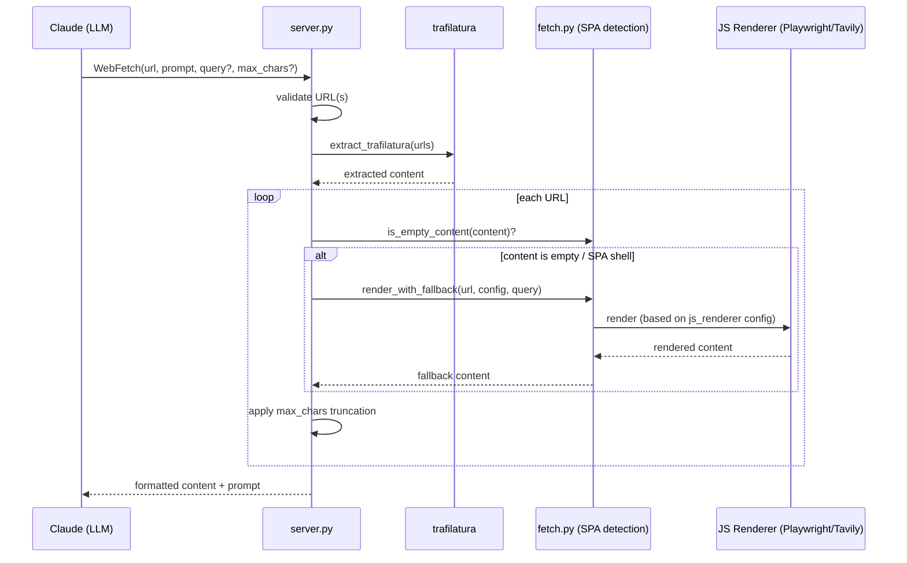
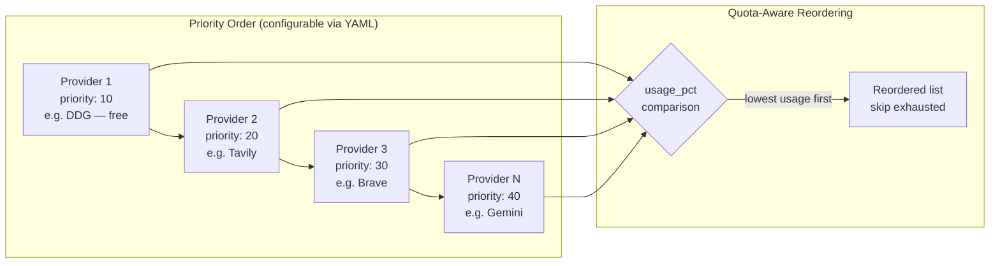
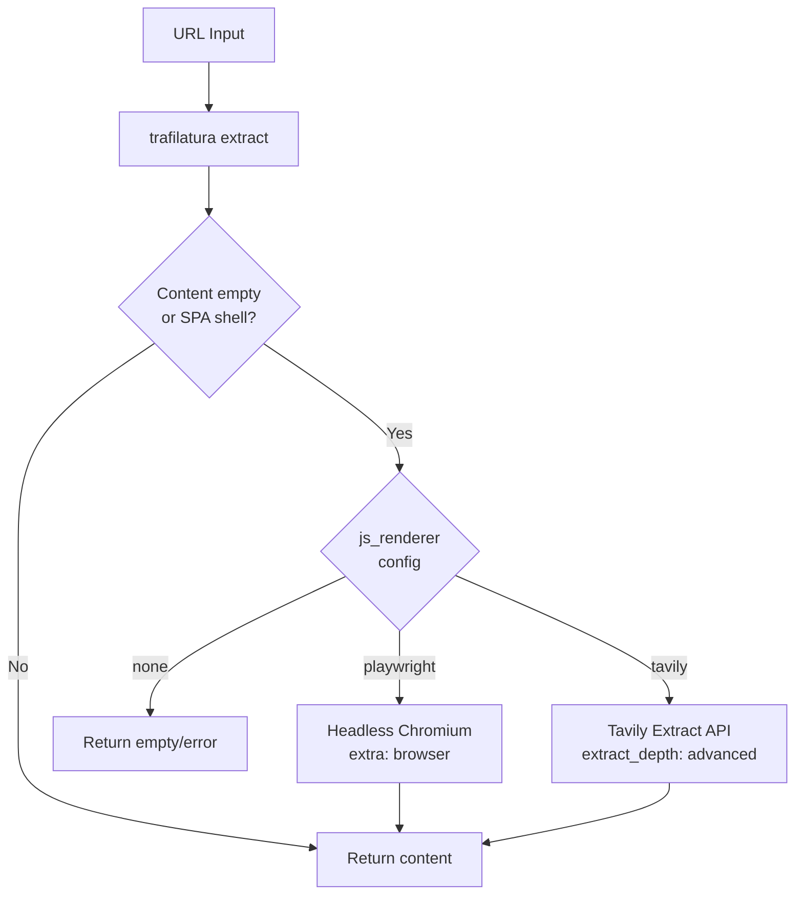

# Architecture

## System Overview



## Request Flow — WebSearch



## Request Flow — WebFetch



## Provider Failover Strategy



> Built-in adapters: DDG, Tavily, Brave, Gemini, SearXNG, and a generic `json_api` adapter for any REST search API. New adapters are one class.

## WebFetch JS Fallback



## File Structure

```
pivot-web-search/
├── .claude-plugin/          # Claude Code plugin manifest
│   ├── plugin.json          # Tool declarations, userConfig schema
│   └── marketplace.json     # Marketplace listing
├── .mcp.json                # MCP server launch config (stdio)
├── config/
│   ├── providers.yaml       # Search providers (type, priority, key)
│   ├── proxies.yaml         # Proxy endpoints (failover order)
│   └── fetch.yaml           # WebFetch config (JS renderer, limits)
├── hooks/
│   └── hooks.json           # PreToolUse block + SessionStart health
├── scripts/
│   └── health-check.py      # Startup probe (parallel provider check)
├── pivot_web_search_mcp/
│   ├── __init__.py
│   ├── __main__.py          # Entry: mcp.run(transport="stdio")
│   ├── server.py            # FastMCP server, 3 tools
│   ├── search.py            # Core: search, proxy fallback, extraction, dedup_and_rank
│   ├── providers.py         # ProviderRegistry, adapters, config loaders
│   ├── fetch.py             # SPA detection, JS renderer dispatch
│   └── quota.py             # Per-provider quota tracking, filelock (cross-platform)
├── tests/                   # 147+ tests (pytest), 7 modules
├── skills/pivot-web-search/       # Skill definition for Claude Code
└── docs/                    # Architecture diagram, archived design docs
```

## Key Design Principles

1. **Zero mandatory external deps for search** — DDG works with no API key
2. **Graceful degradation** — if a provider fails or is exhausted, next one takes over
3. **Config-driven** — providers, proxies, and fetch behavior all via YAML, hot-reloadable
4. **Quota-aware** — tracks API usage, prefers cheapest available provider
5. **Optional heavy deps** — Playwright only installed via the `browser` extra (`uv sync --extra browser`)
6. **Proxy failover** — every HTTP call goes through the proxy chain (direct by default, configurable)
7. **Security by default** — SSRF protection, pre-redirect blocking, credential redaction
8. **Cross-platform** — filelock instead of fcntl, works on Windows/macOS/Linux
9. **Thread-safe** — all shared mutable state protected by `threading.Lock`
